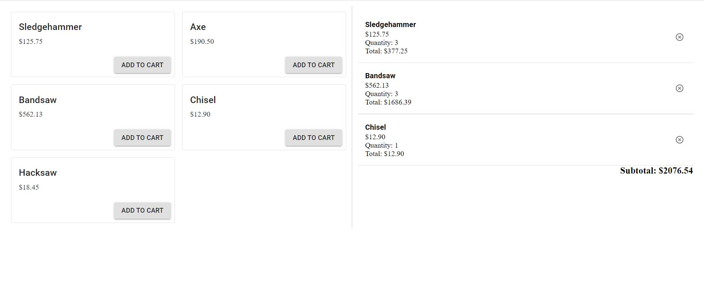

# Basic shopping cart in React

## Setup

This project requires:

- [Node.js (v14.17.1)](https://nodejs.org/en/)
- [Yarn (v1.22.10)](https://yarnpkg.com/getting-started/install)

Once you have installed Node.js onto your machine, install yarn with the following command:

`npm install -g yarn` 

Then run the following in your project directory to install the dependencies required for this project:

`yarn install`

_This project was bootstrapped with [Create React App](https://github.com/facebook/create-react-app). You can learn more in the [Create React App documentation](https://facebook.github.io/create-react-app/docs/getting-started)._

## Development

To run the code in your local browser, run the following in your command prompt.

`yarn start`

This runs the app in the development mode.\
Open [http://localhost:3000](http://localhost:3000) to view it in the browser.

The page will reload if you make edits.\
You will also see any lint errors in the console.

## Possible future improvements/features

- Ability to add/subtract item quantity from cart.
- Implement actual database to store products.
- Make it pretty.

## Screenshot

